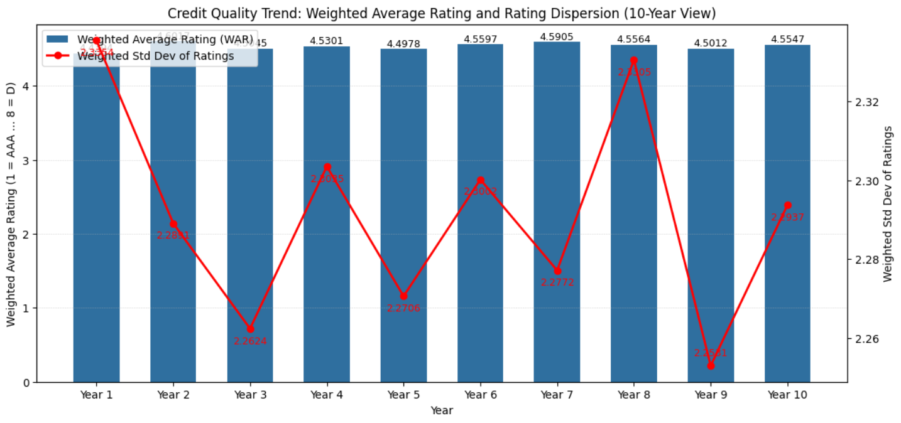
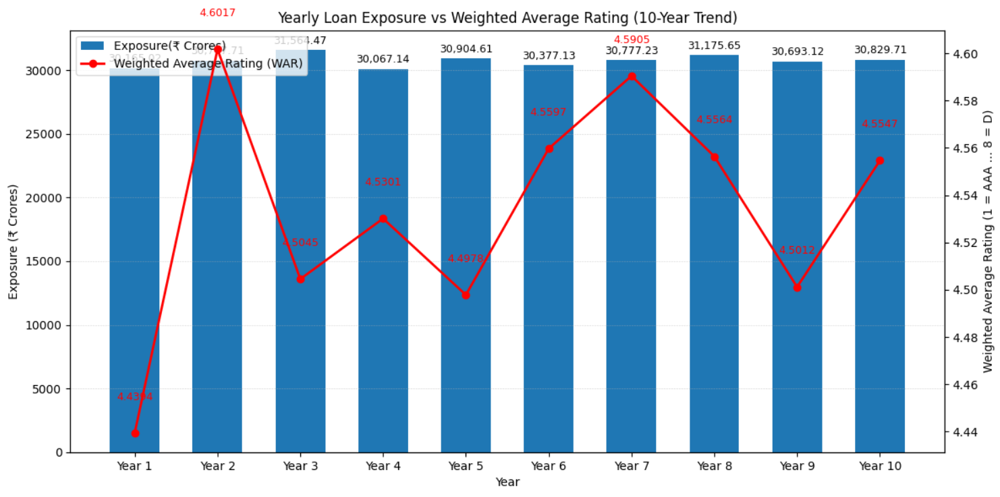
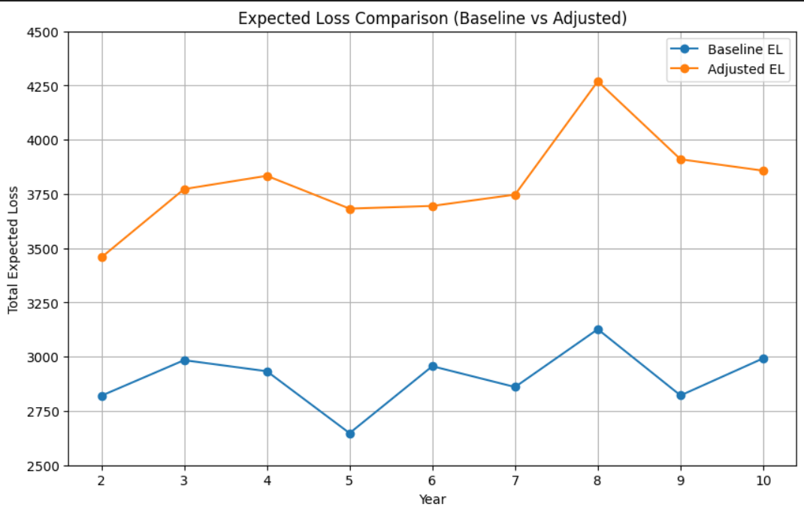
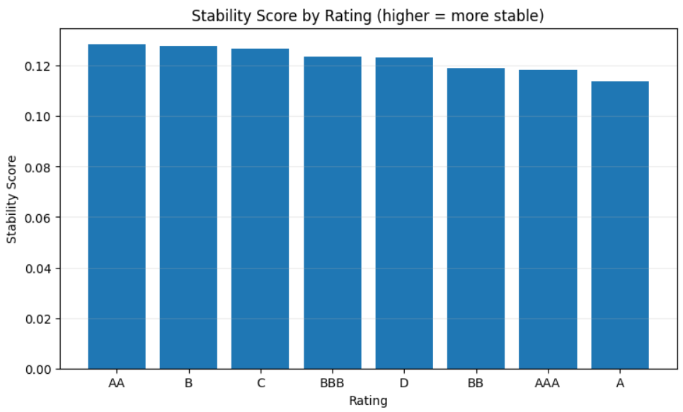

# Credit Risk Stress Testing and Default Analysis using Python

## Overview

This project presents a comprehensive credit risk portfolio analysis framework using transition matrices, probability of default (PD) estimation, expected loss (EL) modeling, and stress testing techniques. The objective is to evaluate portfolio credit quality, quantify default risk, assess expected losses under normal and stressed conditions, and identify changes in portfolio risk over time.

The analysis is based on a multi-year borrower rating portfolio and incorporates credit migration modeling, cumulative default probability estimation, and portfolio stability assessment.

---

## Business Problem

Banks and financial institutions must continuously monitor the quality of their loan portfolios to estimate potential losses and maintain adequate capital buffers.

This project addresses the following key questions:

* How has the credit quality of the portfolio evolved over time?
* What is the probability of borrower default across rating categories?
* What are the expected losses under normal economic conditions?
* How do losses change under adverse stress scenarios?
* Which rating categories exhibit the highest stability and lowest migration risk?
* How can significant shifts in portfolio risk be identified?

---

## Project Objectives

* Perform exploratory analysis of portfolio composition and rating distribution.
* Construct annual rating transition matrices.
* Estimate Probability of Default (PD) across rating categories.
* Calculate Expected Loss (EL) using PD, LGD, and EAD.
* Measure cumulative portfolio default probability.
* Conduct stress testing under adverse credit conditions.
* Analyze rating migration behavior and portfolio stability.
* Generate risk insights to support portfolio management decisions.

---

## Methodology

### Portfolio Exploratory Analysis

* Rating Distribution Analysis
* Portfolio Composition Analysis
* Exposure Analysis
* Credit Quality Trends
* Rating Dispersion Analysis

### Credit Migration Modeling

* Transition Matrix Construction
* Rating Migration Tracking
* Credit Quality Movement Analysis
* Rating Stability Assessment

### Probability of Default Estimation

* Rating-wise PD Estimation
* Portfolio PD Calculation
* Multi-Year Default Trend Analysis

### Expected Loss Modeling

Expected Loss is estimated using:

EL = PD \times LGD \times EAD

Where:

* PD = Probability of Default
* LGD = Loss Given Default
* EAD = Exposure at Default

The model estimates:

* Rating-wise Expected Loss
* Portfolio Expected Loss
* Multi-Year Loss Trends

### Stress Testing Framework

Two stress scenarios are evaluated:

#### Scenario 1: LGD Stress

* LGD increased according to stress assumptions.
* Stressed Expected Loss calculated.
* Comparison against baseline portfolio losses.

#### Scenario 2: Rating Slippage

* Credit rating deterioration simulated.
* Impact on portfolio default risk measured.
* Incremental loss estimation performed.

### Portfolio Risk Analytics

* Rating Stability Assessment
* Portfolio Migration Analysis
* Risk Shift Identification
* Statistical Risk Evaluation

---

## Key Visualizations

### Weighted Average Rating Trend

Tracks overall portfolio credit quality across years.

### Exposure vs Rating Analysis

Evaluates changes in portfolio exposure relative to rating quality.

### Probability of Default and Expected Loss Trends

Shows the evolution of default risk and expected portfolio losses.

### Stress Testing Analysis

Compares baseline and stressed expected losses.

### Rating Stability Assessment

Identifies rating categories exhibiting the highest stability over time.

---

## Key Findings

* Portfolio credit quality was evaluated using rating migration analysis.
* Transition matrices revealed borrower movement across risk categories.
* Probability of Default was estimated for all rating classes.
* Expected Loss trends highlighted periods of increased portfolio risk.
* Stress testing demonstrated the sensitivity of losses to deteriorating credit conditions.
* Rating stability analysis identified the most resilient borrower segments.
* Portfolio-level risk metrics provided insights for capital planning and risk management.

---

## Tech Stack

| Tool             | Purpose                   |
| ---------------- | ------------------------- |
| Python           | Risk Modeling & Analytics |
| Pandas           | Data Processing           |
| NumPy            | Numerical Computation     |
| Matplotlib       | Data Visualization        |
| SciPy            | Statistical Analysis      |
| Jupyter Notebook | Analysis Environment      |

---

## Skills Demonstrated

### Risk Analytics

* Credit Risk Analysis
* Probability of Default Modeling
* Expected Loss Estimation
* Portfolio Risk Management
* Rating Migration Analysis
* Stress Testing

### Data Analytics

* Exploratory Data Analysis (EDA)
* Statistical Modeling
* Data Visualization
* Trend Analysis
* Risk Reporting

### Technical Skills

* Python
* Pandas
* NumPy
* Matplotlib
* Financial Risk Analytics
* Credit Portfolio Modeling

---

## Repository Structure

```text
Credit-Risk-Stress-Testing-and-Default-Analysis/

├── Credit_Risk_Portfolio_Analysis.ipynb
├── README.md
└── images/
    ├── weighted_average_rating.png
    ├── exposure_vs_rating.png
    ├── pd_el_trend.png
    ├── stress_testing.png
    └── rating_stability.png
```

---

## Key Visualizations

### Weighted Average Rating Trend



### Exposure vs Rating Analysis



### Probability of Default and Expected Loss Trend


### Stress Testing Analysis



### Rating Stability Assessment



---

## Business Impact

The framework developed in this project mirrors methodologies used by banks and financial institutions for:

* Credit Portfolio Monitoring
* Risk Management
* Capital Adequacy Planning
* IFRS 9 / Expected Credit Loss Analysis
* Stress Testing Exercises
* Regulatory Risk Reporting

---

## Author

**Rithish Rao**
BITS Pilani Hyderabad Campus
Mechanical Engineering

Interested in Data Analytics, Risk Analytics, Product Analytics, and Financial Modeling.
